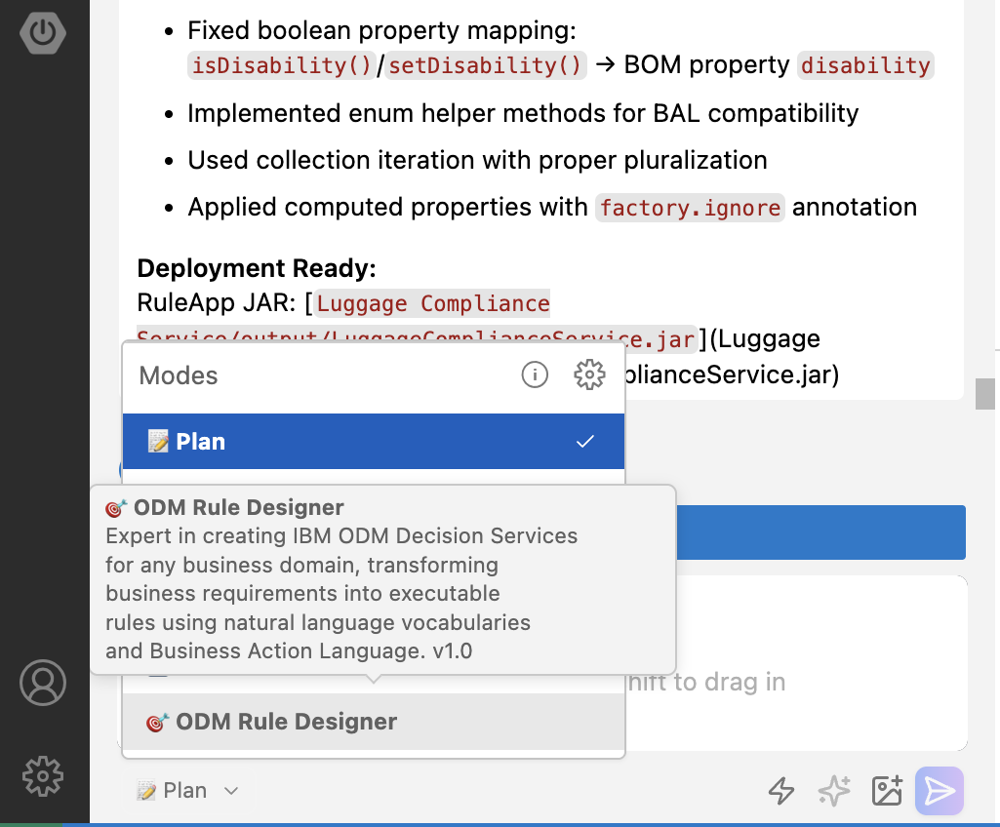
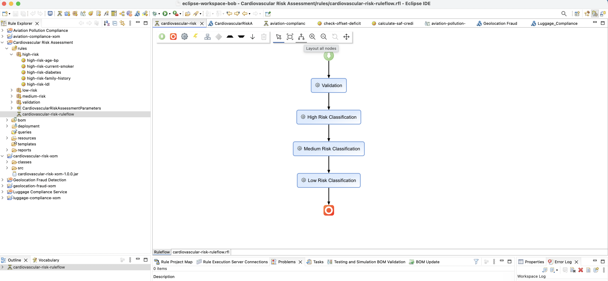

# 🎯 ODM Rule Designer — Geolocation Fraud Detection

> **Generate a production-ready IBM ODM Decision Service from a natural language prompt — in minutes.**

This lab uses the custom **🎯 ODM Rule Designer** Bob mode to generate a complete, importable ODM project for geolocation-based fraud detection. The `rules-compiler.jar` is already included — no additional setup required.

---

## 🤖 What is the ODM Rule Designer Bob Mode?

The **ODM Rule Designer Mode** is a custom Bob mode that acts as an expert ODM developer. Describe your business rules in natural language and Bob generates:

- ✅ Complete XOM (Java domain model)
- ✅ BOM (Business Object Model) with natural language vocabulary
- ✅ Business rules in Business Action Language (BAL)
- ✅ Ruleflow orchestration
- ✅ Deployment configuration
- ✅ Build validation using the ODM Build Command

**All generated projects are fully compatible with ODM Rule Designer.**

---

## 🚀 Quick Start

### Prerequisites

- **IBM Bob** installed and signed in
- **ODM Rule Designer** installed on this machine
- This folder open in Bob (`File → Open Folder → 04-odm-mode`)

---

### 1️⃣ Import the ODM Rule Designer Bob Mode

1. Open Bob settings: gear icon **⚙️** in the upper right
2. Select **Modes** from the left panel
3. Click **Import**
4. Select [`files/custom_modes.yaml`](files/custom_modes.yaml)
5. The **🎯 ODM Rule Designer** mode now appears in the mode selector ✅

---

### 2️⃣ Generate the Decision Service

1. Select **🎯 ODM Rule Designer** from the mode selector at the bottom of Bob

   

2. Open [`files/geolocation-fraud-detection-prompt.md`](files/geolocation-fraud-detection-prompt.md) and copy the full prompt text.

3. Paste it into the Bob chat input.

4. Optionally click **✨ Enhance prompt** for richer context (recommended).

5. Watch Bob generate the complete project in real time inside a new subfolder `Geolocation_Fraud_Detection/`:

   | Generated Artifact | Description |
   |--------------------|-------------|
   | `geolocation-fraud-xom/src/…/*.java` | Java domain model (XOM) |
   | `bom/*.bom` + `*.b2xa` | Business Object Model |
   | `bom/*_en_US.voc` | Natural-language vocabulary for BAL |
   | `rules/**/*.brl` | Business rules in Business Action Language |
   | `ruleflow/*.rfl` | Ruleflow orchestrating rule execution |
   | `deployment/*.dep` + `*.dop` | Deployment configuration |

> **Tip:** Bob runs a quality check after generation and prints scores for rule documentation, BOM coverage, and vocabulary completeness. The reference project scores **66.4 / 100 (Grade D)** — can you beat it?

---

### 3️⃣ Import into ODM Rule Designer

1. Open **ODM Rule Designer** (Eclipse with the Rule perspective)
2. Switch to the Rule perspective: `Window → Perspective → Rule → Open`
3. Import both projects: `File → Import → General → Existing Projects into Workspace`
   - Select the **Rule project** folder (`Geolocation_Fraud_Detection`)
   - Select the **XOM project** folder (`geolocation-fraud-xom`)
   - Click **Finish**
4. Open the `.rfl` ruleflow file → click **Layout all nodes** → **Save**

   

5. Browse the rule packages and open a `.brl` file to inspect the generated BAL syntax.

---

## 🏗️ Project Structure

```
04-odm-mode/
├── files/
│   ├── custom_modes.yaml                        # Bob mode definition
│   ├── geolocation-fraud-detection-prompt.md    # Input prompt for this lab
│   └── buildcommand/
│       └── rules-compiler/
│           └── rules-compiler.jar               # ODM Build Command compiler ✅
├── Geolocation_Fraud_Detection/                 # Generated by Bob (after Step 2)
│   ├── Geolocation_Fraud_Detection/             # Rule project
│   │   ├── bom/
│   │   ├── rules/
│   │   ├── ruleflow/
│   │   └── deployment/
│   └── geolocation-fraud-xom/                   # XOM project
│       └── src/fraud/geolocation/
├── images/
└── README.md
```

---

## 💡 Explore and Improve

Once the project is generated, try one of these follow-up prompts:

- **Simplify a complex rule** — the quality check flags 15 high-complexity rules:
  ```
  Break the rule "score-unusual-corridor" into smaller, more maintainable rules.
  ```
- **Improve the vocabulary score** — the reference project scores 0/20 on vocabulary:
  ```
  Add complete business vocabulary entries for all BOM classes.
  ```
- **Add a rule** — extend the fraud detection logic:
  ```
  Add a rule that flags transactions over 10 000 EUR from a new device as high-risk.
  ```
- **Improve the overall score**:
  ```
  Improve the quality score of this ODM project.
  ```

---

## 📊 Reference Quality Scores

| Metric | Reference Value |
|--------|----------------|
| Rule Documentation | 100 % (22/22 rules) |
| Project Organization | 4 packages |
| BOM Coverage | 5 classes defined |
| Rule Complexity (simple rules) | 31.8 % (7/22) |
| Vocabulary Coverage | 0 % |
| **Overall Quality Score** | **66.4 / 100 — Grade D** |

---

## 📄 Reference

- [Bob mode definition](files/custom_modes.yaml)
- [Geolocation Fraud Detection prompt](files/geolocation-fraud-detection-prompt.md)
- [Bob documentation](https://bob.ibm.com/docs)

[Back to workshop guide](../README.md)
